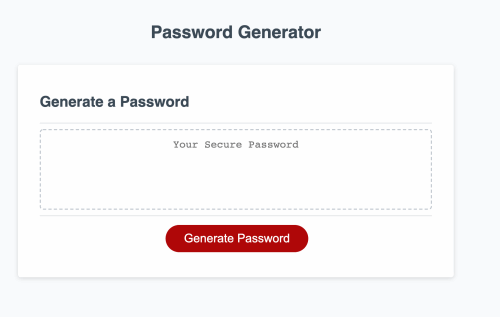

# Password Generator
It generates a random password based on user-selected criteia.

How to work
1. Prompt a user to choose length of a password - Range from 8 to 128.
2. Prompt a use to selet criteria to include in the password.
    1) Numeric
    2) Special Charactor
    3) Uppercase
    4) Lowercase
3. Generate the password.

LINK : https://congmul.github.io/PasswordGenerator/

 
